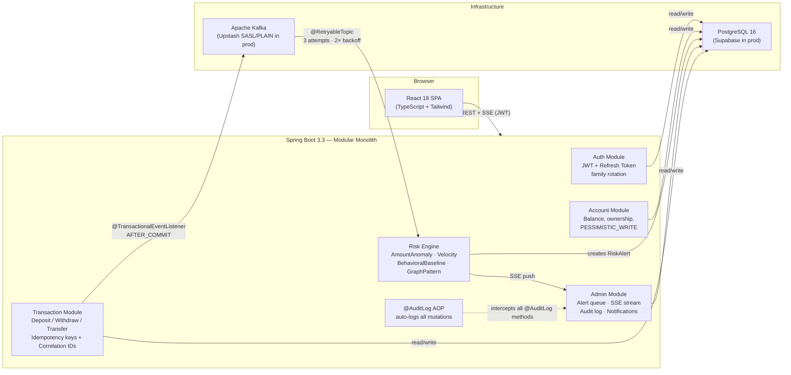

# LedgerBridge

**Banking transaction monitoring and statistical fraud detection — built for production-grade portfolio review.**

[](https://github.com/cs-keni/ledgerbridge/actions/workflows/ci.yml)
[](https://ledgerbridge-i0c5.onrender.com)
[](https://openjdk.org/projects/jdk/21/)
[](https://spring.io/projects/spring-boot)
[]()

---

## Live Demo

**URL:** https://ledgerbridge-i0c5.onrender.com

| Field | Value |
|---|---|
| Email | `demo@ledgerbridge.io` |
| Password | `password` |
| Role | `DEMO_ACTOR` — can view alerts, trigger transactions, audit log |

> **Cold start:** Render's free tier sleeps after 15 minutes. First request takes 30–60 seconds to wake. Subsequent requests are fast.

**Demo loop:**
1. Log in → you land on the **Risk Alerts dashboard** (pre-seeded with fraud scenarios)
2. Click an alert → inspect the **RiskGauge** showing the weighted score breakdown
3. Go to **Transfer** → submit a deposit or transfer to trigger the live risk engine
4. Watch the alert appear in the dashboard within seconds via Server-Sent Events

---

## What This Is

LedgerBridge is a modular-monolith banking backend with a React admin dashboard. The core feature is a **statistical fraud detection engine** — not rule thresholds, but:

- **Z-score anomaly detection** on transaction amounts (Welford's online algorithm, no full scan)
- **Sliding-window velocity analysis** (configurable time windows, single aggregation query)
- **Behavioral baselining** (time-of-day, MCC code, new counterparty detection)
- **Graph pattern detection** (fan-out ≥5 new recipients, fan-in ≥5 new senders, round-trip exact-amount match)

Each rule produces an independent 0–1 raw score. The engine applies weighted aggregation plus two escalation tiers:

```
AmountAnomalyRule      × 0.25
VelocityRule           × 0.30
BehavioralBaselineRule × 0.20
GraphPatternRule       × 0.25

Tier 1 (single rule):  any rule raw ≥ 0.8  → floor score to 0.65 (HIGH)
Tier 2 (multi-rule):   ≥ 3 rules raw ≥ 0.6 → floor score to 0.80 (CRITICAL)
Alert threshold: composite ≥ 0.4
```

Severity mapping: `CRITICAL ≥ 0.8 | HIGH ≥ 0.6 | MEDIUM ≥ 0.4`

---

## Architecture



**Key architectural decisions** (full rationale in `docs/adr/`):

| Decision | Choice | Why |
|---|---|---|
| Money type | `NUMERIC(19,4)` / `BigDecimal` | No floating-point rounding errors |
| Event publish | `@TransactionalEventListener(AFTER_COMMIT)` | Guarantees Kafka event fires only if DB commit succeeds |
| Balance lock | `PESSIMISTIC_WRITE` (fixed lock ordering) | Prevents phantom reads and deadlocks on concurrent transfers |
| Risk profiling | Welford's online algorithm | O(1) per transaction, no full-table statistical queries |
| Baseline poisoning | Skip profile update if score ≥ 0.4 | Fraudulent transactions don't corrupt the baseline |
| Retries | `@RetryableTopic` (3 attempts, 2× backoff) → DLT | Kafka consumer failures don't drop alerts silently |
| SSE | `SseEmitter` registry + 15s heartbeat | Render's reverse proxy closes idle connections; heartbeat keeps them alive |
| Idempotency | SHA-256 request hash, 24h TTL | Duplicate POSTs from retrying clients produce one transaction |
| Migrations | Flyway (versioned + demo profile) | Reproducible schema across dev / staging / prod |

---

## Stack

| Layer | Technology |
|---|---|
| Language | Java 21 (virtual threads enabled) |
| Framework | Spring Boot 3.3.5 |
| Security | Spring Security + JJWT 0.12.5 |
| ORM | Spring Data JPA + Hibernate |
| Database | PostgreSQL 16 |
| Migrations | Flyway |
| Message Broker | Apache Kafka 3.7 (Bitnami KRaft) |
| Frontend | React 18 + TypeScript + Tailwind CSS + React Query + Zustand |
| API Docs | SpringDoc OpenAPI 2.5 (Swagger UI) |
| Testing | JUnit 5 + Mockito + Testcontainers (89 tests) |
| Containers | Docker + Docker Compose |
| CI | GitHub Actions |
| Logging | SLF4J + Logback + logstash-logback-encoder (structured JSON in prod) |
| JSONB | Hypersistence Utils 3.7 |
| Prod DB | Supabase (managed PostgreSQL) |
| Prod Host | Render (Docker, free 750h/month) |
| Prod Kafka | Upstash (SASL/PLAIN, serverless) |

---

## Running Locally

**Prerequisites:** Java 21, Docker, Maven (or use `./mvnw`)

```bash
# 1. Copy env template
cp .env.example .env
# Edit .env — set JWT_SECRET to a 32+ char random string

# 2. Start PostgreSQL + Kafka
docker-compose up -d db kafka

# 3. Run the app (dev profile = human-readable logs)
./mvnw spring-boot:run -Dspring-boot.run.profiles=dev

# 4. Open Swagger UI
open http://localhost:8080/swagger-ui.html

# 5. (Optional) Start the React dev server with hot reload
cd frontend && npm install && npm run dev
# Frontend: http://localhost:5173 (proxied to Spring Boot)
```

**With full observability stack (Prometheus + Grafana):**

```bash
docker-compose up -d
# Grafana: http://localhost:3000 (admin / from GRAFANA_PASSWORD in .env)
# Risk engine dashboard pre-provisioned
```

**Run tests:**

```bash
./mvnw test
# Testcontainers spins up real PostgreSQL + Kafka — no mocks
# 89 tests, including 5 end-to-end fraud scenario tests
```

---

## Fraud Scenarios (Swagger)

All five are documented with `@Operation` + `@ApiResponse` on the transaction endpoints. From Swagger UI:

| Scenario | Endpoint | What to send | Expected score |
|---|---|---|---|
| Normal deposit (negative control) | `POST /api/transactions/deposit` | Small amount, same counterparty | < 0.4 (no alert) |
| Velocity spike | `POST /api/transactions/transfer` | ≥8 transfers in 1h | ≥ 0.4 MEDIUM |
| Large amount, new counterparty | `POST /api/transactions/transfer` | Amount > 3σ above baseline, new recipient | ≥ 0.6 HIGH |
| Fan-out pattern | `POST /api/transactions/transfer` | ≥5 new recipients in 24h | ≥ 0.6 HIGH |
| Round-trip | `POST /api/transactions/transfer` | Same amount sent to X, then received back from X within 2h | ≥ 0.8 CRITICAL |

---

## API Surface

```
POST  /api/auth/register
POST  /api/auth/login
POST  /api/auth/refresh
POST  /api/auth/logout

GET   /api/accounts
POST  /api/accounts
GET   /api/accounts/{id}
GET   /api/accounts/{id}/transactions

POST  /api/transactions/deposit
POST  /api/transactions/withdrawal
POST  /api/transactions/transfer
GET   /api/transactions/{id}

GET   /api/admin/alerts
GET   /api/admin/alerts/{id}
PATCH /api/admin/alerts/{id}/review
GET   /api/admin/alerts/stream        ← SSE (real-time)
GET   /api/admin/customers/{id}/risk-profile
GET   /api/admin/audit-log

GET   /api/user/profile
GET   /api/user/notifications
PATCH /api/user/notifications/{id}/read

GET   /actuator/health/liveness
GET   /actuator/prometheus
```

---

## Known Limitations

- **No Transactional Outbox:** If the DB commit succeeds but Kafka publish fails, the transaction is saved but no risk scoring occurs. The event is not retried. An outbox pattern (e.g. Debezium CDC) would close this gap.
- **SSE on Render free tier:** Render's reverse proxy terminates long-lived connections after ~30 seconds. The client reconnects with exponential backoff (1s → 30s). The connection dot shows "Reconnecting..." during the gap — alert counts stay accurate via REST polling.
- **Approximate Kafka ordering on retry:** `@RetryableTopic` retries may land on a different partition, breaking userId-based ordering. Idempotency keys prevent duplicate processing; ordering is not guaranteed.

---

## Project Structure

```
src/main/java/com/ledgerbridge/
├── account/          AccountController, AccountService, Account entity
├── transaction/      TransactionController, TransactionService, Kafka producer
├── risk/
│   ├── rules/        AmountAnomalyRule, VelocityRule, BehavioralBaselineRule, GraphPatternRule
│   ├── engine/       RiskEngine (weighted aggregation + escalation tiers)
│   ├── consumer/     TransactionRiskConsumer (@RetryableTopic)
│   └── service/      AlertService, CustomerRiskProfileService
├── audit/            AuditAspect (@AuditLog AOP), AuditService, AuditController
├── auth/             AuthController, AuthService, JwtService
├── notification/     NotificationService, NotificationController
└── common/           CorrelationIdFilter, SpaFallbackController, IdempotencyService

frontend/src/
├── pages/            AlertsPage, AlertDetailPanel, DashboardPage, TransferPage, AuditLogPage
├── components/       RiskGauge (SVG + spring animation), AlertTable, Sidebar
├── hooks/            useAlertStream (SSE + reconnect)
└── stores/           authStore (Zustand), sseStore

docs/
├── AI_CONTEXT.md     Architecture decisions, risk engine spec, stack versions
├── adr/              Architecture Decision Records (15, see list below)
└── RISK_ENGINE_TEST_MATRIX.md   Per-scenario score derivations + test assertions

db/migration/         V1–V13 Flyway migrations (versioned)
db/demo/              V13__demo_alerts_and_audit.sql (demo profile only)
monitoring/           Prometheus config + Grafana dashboard JSON
.github/workflows/    ci.yml (Java 21 + Node 20 matrix)
```

---

## Architecture Decision Records

Full rationale for every non-obvious decision lives in `docs/adr/`:

| ADR | Decision |
|---|---|
| ADR-001 | UUID primary keys |
| ADR-002 | `NUMERIC(19,4)` for all monetary values |
| ADR-003 | Flyway for schema migrations (not Liquibase) |
| ADR-004 | Kafka userId-keyed partitioning |
| ADR-005 | `@TransactionalEventListener(AFTER_COMMIT)` for event publish |
| ADR-006 | Welford's online algorithm for statistical profiling |
| ADR-007 | `@RetryableTopic` with DLT |
| ADR-008 | `SseEmitter` registry (not WebFlux/Flux) |
| ADR-009 | `PESSIMISTIC_WRITE` + fixed lock ordering |
| ADR-010 | Stripe-style idempotency keys |
| ADR-011 | Correlation ID propagation (HTTP header → MDC → Kafka header) |
| ADR-012 | JSONB + Hypersistence Utils for `CustomerRiskProfile` |
| ADR-013 | `RiskRuleResult` record (sealed result type per rule) |
| ADR-014 | `@AuditLog` naming (avoids Hibernate Envers collision) |
| ADR-015 | Composite indexes in explicit Flyway migrations (not `@Index`) |

---

## Author

**Kenny Nguyen** — CS grad, University of Oregon 2025  
Targeting Java/Spring Boot fintech engineering roles  
[GitHub](https://github.com/cs-keni) · [LinkedIn](https://www.linkedin.com/in/kenny-nguyen-cs/)
